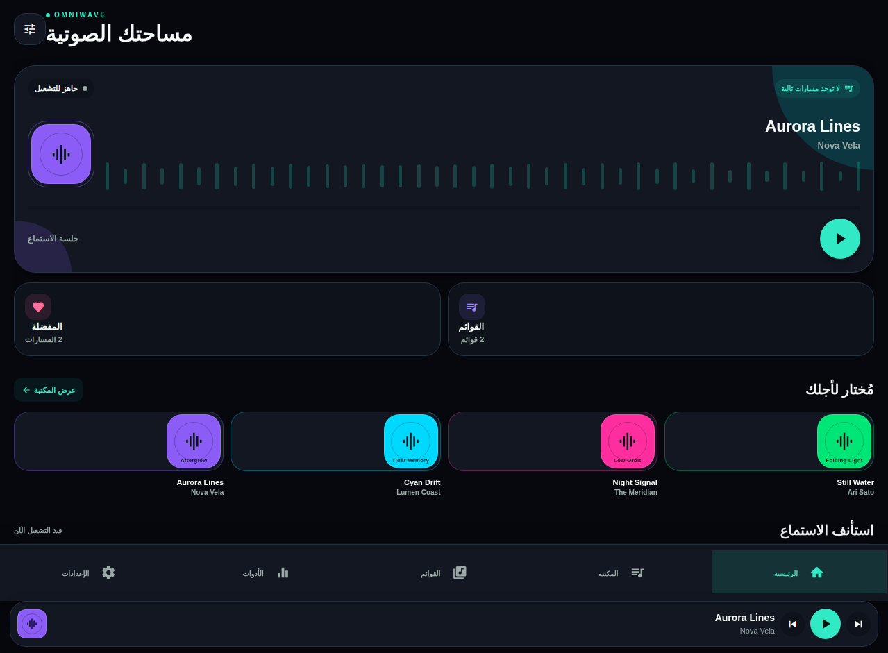
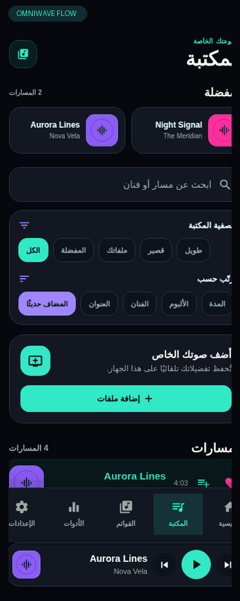
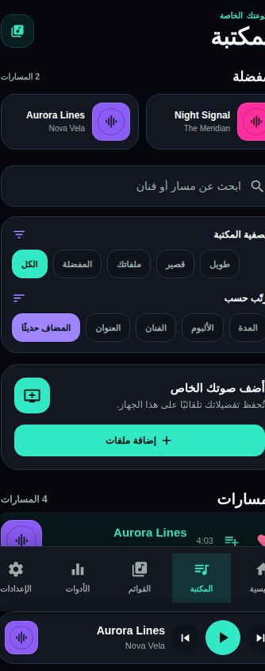
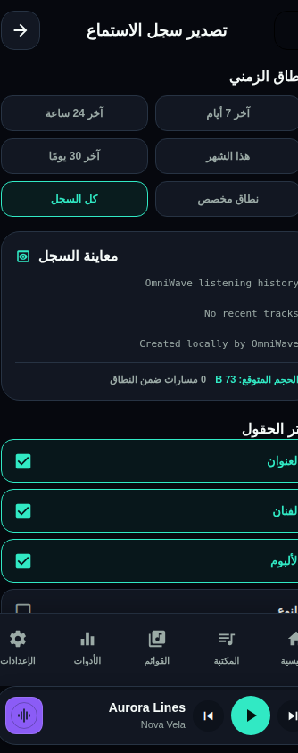
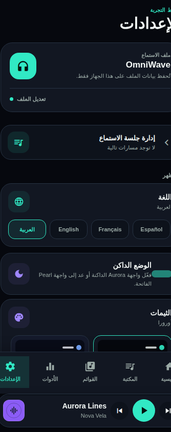

# OmniWave

[](https://github.com/mibrahem98/omniwave-portfolio/actions/workflows/quality.yml)

> A privacy-first local music player for mobile, crafted with Expo and React Native.



OmniWave is a portrait-first music-player experience designed around **local ownership, focused listening, and calm visual hierarchy**. The application keeps a listener’s library, history, playlists, and interface preferences on-device—without accounts, cloud sync, ads, or external analytics.

## Product tour



This short, silent loop follows a real in-app route from library browsing to export configuration and appearance settings. It uses portfolio sample content only and communicates interface flow, not native playback or system-share behavior.

## Screen gallery

### Local library



The library combines local import, filter chips, sorting controls, favorites, and queue actions in an RTL-aware mobile layout.

### Listening-history export



The export flow exposes quick date ranges, a content preview, field selection, format choice, and an estimated local file size before the system share sheet is opened.

### Appearance settings



The settings experience combines four localized languages, an explicit Aurora dark-mode switch, five saved themes, and accessible switches for listening preferences.

## Portfolio highlights

| Area | What is demonstrated |
| --- | --- |
| **Mobile product design** | A polished `Sonic Atelier` visual system, expressive Aurora gradients, refined spacing, accessible states, and one-handed portrait navigation. |
| **Local-first architecture** | Validated local models for tracks, playlists, player snapshots, audio preferences, listening history, and visual-card preferences. |
| **Playback experience** | Full player, mini player, queue management, sleep timer, interactive progress, visual pulse, and transitions that respect reduced-motion preferences. |
| **International UX** | Arabic, English, French, and Spanish, including complete RTL behavior for Arabic. |
| **Personalization** | Five locally saved themes, an explicit Aurora dark-mode switch, audio preferences, equalizer controls, and customizable favorite-share cards. |
| **Privacy-aware sharing** | Previewable TXT/CSV listening-history export and favorite-card sharing that intentionally exclude local audio URIs and file paths. |
| **Reliable delivery** | TypeScript, Vitest contract tests, Expo linting, GitHub Actions static-quality checks, validation of restored local preferences, and explicit native-device test boundaries. |

## Product flows

### Listen with intent

Browse a local collection, filter and sort tracks, add a selection to the queue, and control playback through the focused Now Playing experience or persistent mini player. The interface maintains visible labels and controls alongside touch feedback, rather than relying on color or gestures alone.

### Export a concise local history

Select a quick period—**last 24 hours**, **last 7 days**, **last 30 days**, **this month**, all history, or a custom date range—then choose the metadata fields and TXT or CSV format. OmniWave previews the resulting content and estimates its UTF-8 size before creating the local file. A confirmation card reports the number of exported items before the native share sheet opens.

### Share a favorite visual card

Pick a favorite-card style and accent color, review the card in place, and share a captured image through the operating system. The selected style is stored locally and can be reset without changing favorites, history, or audio preferences.

## Privacy and security boundaries

- **No user accounts, cloud sync, advertising, or external analytics.**
- **No audio files, local file paths, or audio URIs** are included in listening-history exports or favorite-card shares.
- Optional metadata assistance is constrained to approved metadata: title, artist, album, and duration. It does not send the audio file or its path.
- Restored local values are validated before use, and invalid preferences fall back safely.
- Session tokens and cached user data are not logged by the mobile authentication hook.

## Technology

| Layer | Stack |
| --- | --- |
| Mobile | Expo SDK 54, React Native 0.81, TypeScript, Expo Router |
| UI | NativeWind, React Native Reanimated, React Native SVG, Expo Symbols |
| Local persistence | AsyncStorage and SecureStore-backed session utilities |
| Audio and sharing | Expo Audio, Expo Sharing, Expo FileSystem, React Native View Shot |
| Quality | TypeScript, Vitest, Expo ESLint |

## Run locally

```bash
pnpm install
pnpm dev
```

Run the quality gates before making a change:

```bash
pnpm check
pnpm test
pnpm lint
```

## Continuous quality

GitHub Actions runs `pnpm check` and `pnpm lint` on every push to `main`, pull request targeting `main`, and manual workflow dispatch. The workflow has read-only repository permissions and requires no secrets.

## Native validation note

The browser preview is useful for layout and copy review. Audio output routing, background playback, lock-screen controls, system sharing, and date-picker behavior should also be verified on iOS and Android devices or native builds.

## Repository guide

```text
app/                       Expo Router screens and navigation
components/omniwave/       Reusable player and visual UI components
lib/omniwave/              Validated domain models, player state, and sharing utilities
lib/theme-provider.tsx     Local theme, language, RTL, and card-preference state
tests/                     Vitest contracts for privacy, UX, localization, and UI behavior
docs/assets/               Portfolio screenshots
```

---

Built as a mobile product case study for local, private, and deliberate listening.
