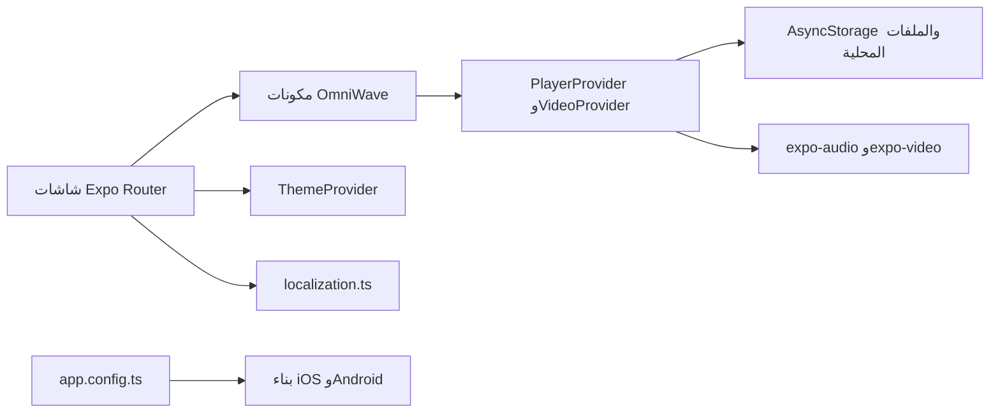

# المعمارية وطريقة عمل النظام

## 1. الطبقات

| الطبقة | المسار | الوظيفة |
|---|---|---|
| التوجيه | `app/` | مسارات Expo Router والشاشات والتبويبات. |
| الواجهة | `components/omniwave/` | الأغلفة والموجة والمشغّل المصغّر والصفوف والتحميل الهيكلي. |
| حالة الموسيقى | `lib/omniwave/player-store.tsx` | مصدر الحقيقة للموسيقى والتشغيل والتاريخ والطابور والاستيراد والتصدير. |
| حالة الفيديو | `lib/omniwave/video-store.tsx` | الفيديوهات والقوائم والتقدم والترجمات والتفضيلات المحلية. |
| نماذج البيانات | `lib/omniwave/types.ts` | `Track` و`Playlist` و`AudioPreferences` و`PlayerSnapshot`. |
| التحقق | `lib/omniwave/validation.ts` | التحقق من URI الصوت قبل الاستعادة أو التشغيل. |
| الترجمة والثيم | `lib/localization.ts` و`lib/theme-provider.tsx` | النصوص متعددة اللغات واتجاه RTL والثيمات المحفوظة. |
| البناء الأصلي | `app.config.ts` | الهوية، الأذونات، الإضافات، وتشغيل الخلفية. |

## 2. النماذج المركزية

| النموذج | الغرض | حقول مهمة |
|---|---|---|
| `Track` | تمثيل مسار صوتي | `id`, `title`, `artist`, `audioUri`, `durationSeconds`, `isFavorite`, والتصنيف المقترح. |
| `Playlist` | قائمة مسارات مرتبة محليًا | `id`, `name`, `trackIds`, `createdAt`. |
| `VideoItem` و`VideoPlaylist` | فيديو محلي وتنظيمه | URI محلي وصورة مصغرة وVTT وتقدم ومفضلة وقوائم فيديو. |
| `AudioPreferences` | تفضيلات الاستماع | الجهير، الصدى، المحيطي، إعدادات مسبقة و10 نطاقات للمعادل والجودة. |
| `VideoPreferences` | تفضيلات مشاهدة | السرعة والتكرار والكتم والترجمة والموضع والخلفية وطول الملخص. |
| `ListeningHistoryEntry` | سجل تشغيل مؤرخ | معرف المسار ووقت التشغيل؛ يستخدم للتصدير المحلي. |
| `PlayerSnapshot` | لقطة عرض لحالة المشغل | المسار النشط، التشغيل، الوقت، التكرار، الخلط، الطابور، مؤقت النوم. |

## 3. استعادة البيانات وحفظها

1. يبدأ `PlayerProvider` ببيانات أولية آمنة.
2. يقرأ التخزين المحلي ويحلل JSON داخل كتلة معالجة خطأ.
3. يتحقق من بنية المسارات والقوائم والتفضيلات ويحد أطوال المصفوفات والنصوص.
4. يعيد تعيين المسار النشط إلى أول مسار محفوظ صالح عند الحاجة.
5. يحفظ التغيرات الصالحة إلى `AsyncStorage` بعد اكتمال التهيئة.

هذه الخطوات تمنع ملفًا محليًا تالفًا أو URI غير صالح من جعل واجهة المشغل غير قابلة للاستخدام.

## 4. دورة تشغيل الصوت

| المرحلة | المسؤول |
|---|---|
| اختيار المسار | مكتبة أو قائمة أو صف وصول سريع أو المشغل المصغر. |
| التحقق | `isSafeAudioUri` قبل `player.replace` أو `player.play`. |
| إدارة الجلسة | `setAudioModeAsync` مع التشغيل الصامت والخلفي. |
| ملاحظة الحالة | `useAudioPlayerStatus` يبني وقت التقدم والمدة في `PlayerSnapshot`. |
| البيانات النظامية | تفعيل بيانات شاشة القفل من عنوان وفنان وألبوم المسار. |
| التعذر | يضبط المتجر `playbackIssue` وتعرض الواجهة إعادة المحاولة أو العودة للمكتبة. |

## 5. المسارات والواجهات

| المسار | المكوّن | الملاحظة |
|---|---|---|
| `/(tabs)/index` | `app/(tabs)/index.tsx` | الرئيسية وجلسة الاستماع. |
| `/(tabs)/library` | `app/(tabs)/library.tsx` | المكتبة والاستيراد والبحث والوصول السريع. |
| `/(tabs)/playlists` | `components/omniwave/playlists-screen.tsx` | قوائم التشغيل وتفاصيلها. |
| `/(tabs)/now-playing` | `app/(tabs)/now-playing.tsx` | التحكم الموسع بالمسار. |
| `/(tabs)/tools` | `app/(tabs)/tools.tsx` | الطابور ومؤقت النوم والعمليات الموسيقية المساعدة. |
| `/(tabs)/settings` | `app/(tabs)/settings.tsx` | اللغة والثيم والصوت. |
| `/(tabs)/videos` و`/(tabs)/video-player` | شاشات الفيديو | مكتبة الفيديو والمشغل المحلي والترجمة وPiP/التدوير عند توفرهما. |
| `/(tabs)/export-history` | تصدير السجل | النطاق والحقول والصيغة والمعاينة والمشاركة المحلية. |
| `/(tabs)/metadata-review` | مراجعة بيانات المقطع | مراجعة اقتراحات التصنيف المقيدة يدويًا. |

## 6. الإتاحة وRTL

يغلف الجذر التطبيق داخل `GestureHandlerRootView` و`SafeAreaProvider` و`ThemeProvider`. تضيف الشاشات تسمية ودورًا وإشارة حالة لعناصر التحكم المهمة. تُعكس اتجاهات الصفوف والعناصر المناسبة عند العربية، مع إبقاء أزرار مرئية بديلة للإيماءات. يُحترم إعداد تقليل الحركة في مكوني `Reveal` و`CollectionSkeleton`.
