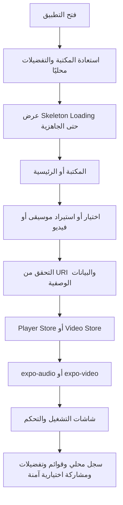

# دليل المشروع والمنتج

## 1. الفكرة والمشكلة

يقدم OmniWave تجربة وسائط محلية للهواتف: يختار الشخص ملفاته الصوتية أو الفيديو من جهازه، فتظهر في مكتبات قابلة للبحث والتنظيم والتشغيل. يمكن إضافة الموسيقى إلى قوائم التشغيل أو قائمة الانتظار، وإرفاق WebVTT بالفيديوهات، مع حفظ بيانات المكتبة والتفضيلات على الجهاز ودون حساب مطلوب لتشغيل التدفقات الأساسية.

| البند | القرار الحالي |
|---|---|
| المستخدم المستهدف | مستمع يريد تحكمًا سريعًا بيد واحدة في ملفاته المحلية. |
| المنصات | iOS وAndroid أولًا، مع معاينة ويب وظيفية للواجهة. |
| اللغات | العربية والإنجليزية والفرنسية والإسبانية، مع RTL للعربية. |
| الخصوصية | المكتبة والتفضيلات وسجل التشغيل محلية افتراضيًا. |
| خارج النطاق الافتراضي | الحسابات، السحابة، الإعلانات، والتحليلات الخارجية. |

## 2. ما يحتويه التطبيق

| الشاشة | المسؤولية الرئيسية | أهم الإجراءات |
|---|---|---|
| الرئيسية | ملخص جلسة الاستماع والوصول السريع | تشغيل/إيقاف، فتح التشغيل الآن، الوصول للمفضلة والقوائم. |
| المكتبة | إدارة الملفات الصوتية | استيراد، بحث، تصفية، ترتيب، مفضلة، انتظار، وصول سريع للمفضلة أو المشغّل مؤخرًا. |
| قوائم التشغيل | تنظيم مجموعات المسارات | إنشاء، إعادة تسمية، ترتيب، إضافة أو إزالة المسارات. |
| التشغيل الآن | التحكم التفصيلي بالمسار | تقدم، قفز، السابق/التالي، تكرار، خلط، مفضلة، استرداد من الخطأ. |
| الأدوات | إدارة قائمة الانتظار ومؤقت النوم | تشغيل ترتيب الطابور، إعادة ترتيبه، مسحه، وإيقاف مؤقت حسب الوقت. |
| الإعدادات | التخصيص المحلي | اللغة، الثيم، جودة الاستماع، المؤثرات، المعادل، وإعادة الضبط. |
| الفيديو | الوسائط المرئية المحلية | استيراد، تشغيل، ترجمات WebVTT، متابعة مشاهدة، سرعة، صوت/سطوع، وPiP عند توفره أصليًا. |
| تصدير السجل | مشاركة بيانات اختيارية محلية | معاينة سجل الاستماع، تحديد نطاق وحقول وصيغة TXT/CSV، ثم مشاركة النظام. |
| مراجعة البيانات | تحكم شخصي في بيانات المقطع | مراجعة اقتراحات تصنيف محدودة البيانات وإعادة التصنيف يدويًا. |

## 3. تدفق الاستخدام الأساسي

## 4. تجربة الاستماع

بعد اختيار مسار، تجعل طبقة الحالة المسار نشطًا وتسجل التاريخ محليًا ثم تتواصل مع `expo-audio`. تظهر حالة التشغيل في الشاشة الرئيسية وشاشة «التشغيل الآن» والمشغّل المصغّر. يدعم المشغّل المصغّر السحب الأفقي لتخطي المسار، لكنه يوفر أيضًا أزرار السابق والتشغيل/الإيقاف والتالي؛ لذلك لا تعتمد إمكانية التحكم على الإيماءة وحدها.

عند تعذر تشغيل مسار أو استيراد دفعة، لا تُعطل المكتبة. تظهر رسالة محلية قابلة للتصرف مع إعادة المحاولة أو العودة إلى المكتبة. يحمي التطبيق البيانات باستبعاد URI غير المدعوم أو المكرر قبل إدخاله في الحالة المحفوظة.

## 5. التخزين والخصوصية

يستخدم التطبيق `AsyncStorage` لتخزين الموسيقى والفيديوهات وقوائمها وسجل التشغيل والتفضيلات وقائمة الانتظار. تُنسخ الملفات المقبولة التي يديرها التطبيق إلى مساحته المحلية عند الحاجة، ولا تُرفع أسماء الملفات أو مساراتها أو URI إلى خدمة خارجية ضمن التدفق الأساسي. عند استخدام المساعدة الاختيارية للبيانات الوصفية، يظل نطاقها محصورًا في العنوان والفنان والألبوم والمدة بعد تأكيد صريح؛ لا يُرسل ملف الصوت أو الفيديو أو مساره.

## 6. التشغيل في الخلفية

يُضبط المشروع لتشغيل الصوت في الخلفية وتهيئة بيانات شاشة القفل عبر إعداد Expo وطبقة المشغّل. يتطلب Android عناصر تحكم شاشة القفل لاستمرار تشغيل الخلفية، فيما تضيف إضافة Expo إعدادات البناء المناسبة للمنصتين عند التهيئة الصحيحة. [1]

> **تنبيه قبول:** لا يثبت متصفح المعاينة سلوك الخلفية أو شاشة القفل أو Bluetooth. يجب فحصها على هاتف iOS وهاتف Android حقيقيين قبل إعلان دعمها مكتملًا.

## المراجع

[1]: TECHNICAL_REFERENCES.md "المراجع التقنية المعتمدة"
